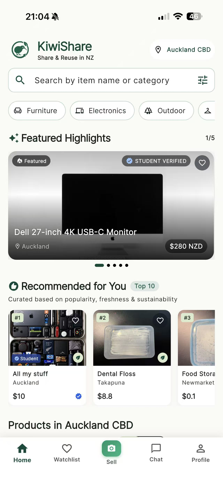
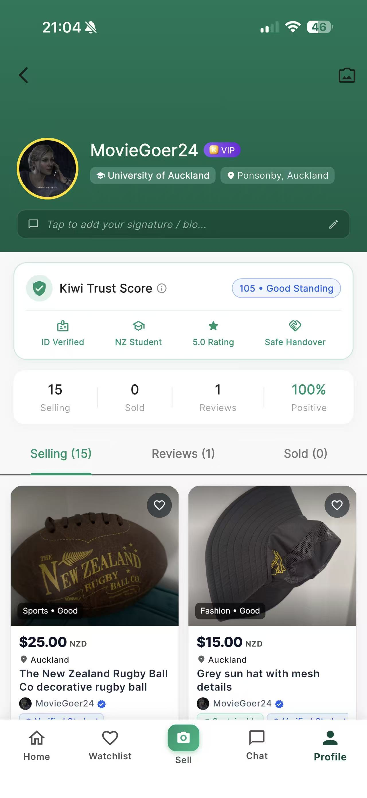
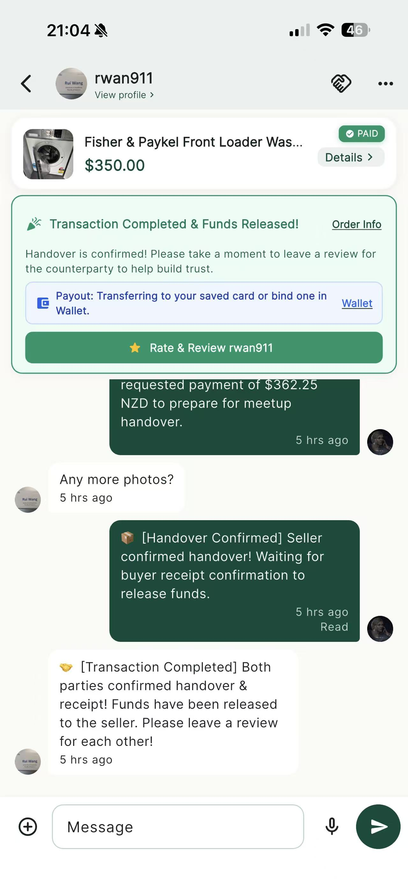

<p align="center">
  
</p>

<h1 align="center">KiwiShare</h1>
<p align="center"><strong>Share & Reuse in New Zealand</strong></p>
<p align="center">A full-stack, cross-platform second-hand marketplace for web, Android and iOS.</p>

<p align="center">
  <a href="https://kiwishare.online">Live website</a> ·
  <a href="docs/architecture.md">Architecture</a> ·
  <a href="docs/api-spec.md">API documentation</a> ·
  <a href="docs/security-owasp.md">Security</a>
</p>

<p align="center">
  
  
  
</p>

## Overview

KiwiShare is a team-built marketplace prototype developed during **COMPSCI 734 at the University of Auckland (2026)**. The product focuses on local discovery, safer person-to-person transactions and practical reuse.

This repository publishes a **sanitized portfolio edition** of the University's private coursework project, including its original development history. The final `main` codebase is retained, while browser profiles, private testing evidence, production credentials, and deployment automation are excluded. Historical commit author names, chronology, merge relationships, branches, and release tags are preserved; commit SHAs differ from the original because sensitive content and private contributor email addresses were removed.

## Features

- Local marketplace browsing, listing creation, item details, search and watchlists
- User accounts, student verification, trust/reputation and moderation tools
- In-app buyer/seller messaging and media sharing
- Order lifecycle, payment integration, meetup coordination and QR-based handover
- AI-assisted listing support, notifications and native device integrations
- Consistent marketplace experiences across Flutter mobile and React web clients

Some features require third-party credentials, infrastructure or platform signing to run outside the original deployment.

## Technology

| Layer | Stack |
| --- | --- |
| Mobile | Flutter / Dart, iOS and Android |
| Web | React, TypeScript, Vite |
| API | Node.js, TypeScript, Koa |
| Database | MongoDB / Mongoose |
| Media | Cloudflare R2 with presigned uploads |
| Authentication / push | Firebase integration |
| Hosting (original project) | Cloudflare Workers and Render |
| Tooling | pnpm monorepo, Jest, Flutter tests, ESLint, GitHub Actions |

## Repository layout

```text
mobile/    Flutter app, platform integrations and tests
web/       React + Vite client and web tests
server/    Koa REST API, business logic and Jest tests
docs/      Architecture, API, design, product and testing documentation
scripts/   Development and performance utilities
```

## Local development

Requirements: Node.js 22+, pnpm 9+, Flutter SDK for the mobile app, and access to your own MongoDB/Firebase/cloud resources as needed.

```bash
corepack enable
pnpm install

# Backend (after configuring server/.env from server/.env.example)
pnpm server:dev

# Web client (configure web/.env from web/.env.example)
pnpm web:dev

# Flutter dependencies and app
cd mobile
flutter pub get
flutter run
```

### Configuration

This public snapshot does **not** contain production service credentials or signing assets. Configure your own environment:

- Copy `server/.env.example` to `server/.env` and supply development credentials.
- Copy `web/.env.example` to `web/.env`; replace the Firebase placeholders and set your API URL.
- For Flutter, use `flutterfire configure` with your own Firebase project to regenerate `mobile/lib/firebase_options.dart`, `mobile/android/app/google-services.json` and `mobile/ios/Runner/GoogleService-Info.plist`. The checked-in Dart options in this portfolio snapshot use placeholders.
- Configure any optional Stripe, R2, Maps, push notification or AI provider integrations yourself.

Do not commit passwords, service account keys, signing keystores, local `.env` files or production tokens.

### Validation

```bash
pnpm server:lint
pnpm server:build
pnpm server:test
pnpm web:build
# with Flutter configured:
pnpm mobile:analyze
pnpm mobile:test
```

See [architecture](docs/architecture.md), [API spec](docs/api-spec.md), [testing strategy](docs/testing-strategy/testing-strategy.md) and [security analysis](docs/security-owasp.md) for design details and trade-offs.

## Project team and attribution

Developed as a five-person University of Auckland group project (**Team Five Guys**). Credit belongs to the whole team; publishing this portfolio snapshot does not imply sole authorship.

- [Sam Yao](https://github.com/yaohuangguan)
- [9yen](https://github.com/9yen)
- [Rui Wang](https://github.com/ruiwang213)
- [Jenny Yin](https://github.com/jennyyinUOA)
- [Arthur](https://github.com/ArthurMorgan750)

The original coursework repository, Issues, Pull Request reviews, and Wiki remain private in the university organisation. This public repository contains a cleaned copy of the Git history (677 original commits, 138 branch names and 15 version tags at migration), followed by the public-portfolio preparation commits. Original commit SHAs and GitHub PR/Issue URLs in old commit messages may not resolve here after rewriting.

## License

**Source-available, not an OSI-approved open-source license.** See [LICENSE](LICENSE). The source can be viewed and studied under the terms of that license; redistribution, commercial use and independently deployed derivatives require permission from the applicable copyright holders.
