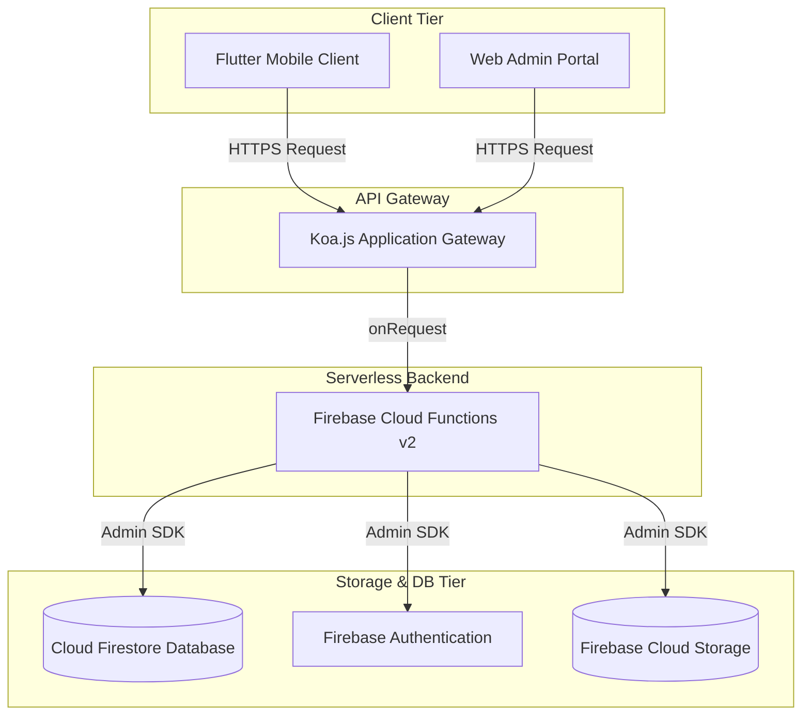

# System Architecture & Native Mobile Integrations

This document describes the high-level architecture, database schemas, and native device integrations for the **KiwiShare** monorepo system.

---

## 1. High-Level Architecture Overview

KiwiShare utilizes a decoupled client-server architecture hosted inside a unified Monorepo:



### Component Roles
* **Flutter Mobile App (`mobile/`)**: Consumer client designed for peer-to-peer sharing, messaging, and rapid item handovers.
* **Koa + TS Backend (`functions/`)**: Serverless gateway hosted on Firebase Cloud Functions, exposing unified endpoints for authentication, item listings, and transactional handovers.
* **Storage & DB**: Firestore for relational document sync, Firebase Auth for identity management, and Storage for listing image binaries.

---

## 2. Shared Firestore Database Schema

KiwiShare maintains a flat, scalable document structure in Firestore:

### `users` Collection
```json
{
  "id": "String (uid)",
  "displayName": "String",
  "avatarUrl": "String?",
  "trustScore": "Number (0-100)",
  "isVerified": "Boolean",
  "createdAt": "Timestamp"
}
```

### `items` Collection
```json
{
  "id": "String (uuid)",
  "title": "String",
  "priceNzd": "String",
  "location": "String (city / suburb)",
  "imageUrl": "String",
  "isSustainable": "Boolean",
  "category": "String (Camping, Plants, etc.)",
  "status": "String (active, reserved, sold)",
  "ownerId": "String (references users.id)",
  "createdAt": "Timestamp"
}
```

### `chats` Collection
```json
{
  "id": "String (uuid)",
  "participants": ["String (user1_uid)", "String (user2_uid)"],
  "lastMessage": "String",
  "lastMessageTime": "Timestamp",
  "unreadCountMap": {
    "user1_uid": 0,
    "user2_uid": 2
  }
}
```

---

## 3. Deep Integration of Native Mobile Capabilities

To deliver a premium mobile experience that stands apart from standard responsive web browsers, KiwiShare leverages Flutter's platform integration channels:

| Capability | Plugin | Integration Use-Case |
| :--- | :--- | :--- |
| **Camera & Image Pick** | `camera`, `image_picker` | Users snap high-resolution photos of physical items directly inside the listing form to process and compress for Firebase Cloud Storage. |
| **Biometric Auth** | `local_auth` | Gated transaction verification: authenticating peer-to-peer exchange transfers with Fingerprint / FaceID before releasing item ownership. |
| **Location & Geofence** | `geolocator` | Computes distances between the current user and items in Aotearoa (e.g. Auckland, Wellington) for geographic listing filtering. |
| **Push Notifications** | `firebase_messaging` | Direct device notification streams alerting users of incoming chat messages even when the app runs in the background. |
