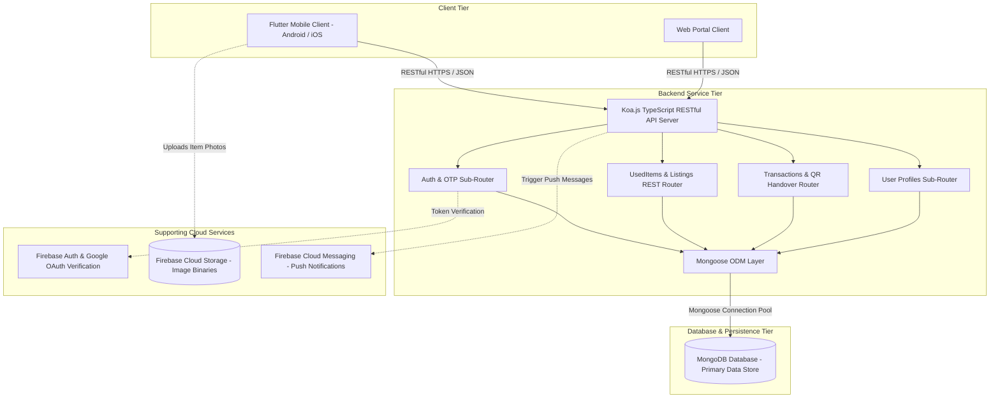

# System Architecture & Native Mobile Integrations

This document describes the high-level system architecture, database schema design, and native device integrations for the **KiwiShare** platform.

---

## 1. High-Level Architecture Overview

KiwiShare utilizes a decoupled client-server architecture hosted in a unified monorepo. Rather than relying purely on serverless Cloud Functions, KiwiShare runs a full, standalone **Node.js / Koa.js TypeScript RESTful Backend** backed by a dedicated **MongoDB** database:



### Component Roles & Responsibilities

* **Flutter Mobile App (`mobile/`)**: Cross-platform consumer application providing native experiences for used item discovery, keyword/category filtering, user trust scoring, and QR-based handover transactions.
* **Koa.js Dedicated RESTful Backend (`server/`)**: Full-featured Node.js / Koa.js application server. Exposes structured RESTful API resources (`/api/usedItems`, `/api/auth`, `/api/users`, `/api/transactions`) with centralized middleware for JWT authentication, request logging, CORS, and unified error handling.
* **MongoDB Database**: Core document database storing structured data models (Users, Used Items / Listings, Orders, OTP records, Transactions, Messages, and Audit Logs) with geospatial indexing (`2dsphere`) for location queries.
* **Supporting Services**:
  - **Firebase Cloud Storage**: Secure media hosting for user-uploaded product images.
  - **Google OAuth / Firebase Auth**: Identity verification tokens.
  - **Resend / SMTP**: Transactional email verification codes for passwordless login.

---

## 2. Core MongoDB Collections & Data Schema

Data persistence is managed via **Mongoose** schemas defining high-integrity document structures:

### `users` Collection
```json
{
  "_id": "ObjectId('64e1f...01')",
  "email": "sam@kiwishare.co.nz",
  "displayName": "Sam Yao",
  "avatarUrl": "https://...",
  "trustScore": 100,
  "isVerified": true,
  "authProvider": "google",
  "passwordHash": "$2a$12$...",
  "createdAt": "2026-08-19T00:00:00.000Z",
  "updatedAt": "2026-08-19T00:00:00.000Z"
}
```

### `items` / `usedItems` Collection
```json
{
  "_id": "ObjectId('64e1f...02')",
  "sellerId": "ObjectId('64e1f...01')",
  "title": "Retro Armchair",
  "description": "Comfortable vintage armchair in great shape.",
  "category": "Furniture",
  "condition": "good",
  "price": 4500,
  "currency": "NZD",
  "priceNzd": "45",
  "images": [
    { "url": "https://...", "thumbnailUrl": "https://...", "sortOrder": 0 }
  ],
  "location": {
    "city": "Auckland",
    "suburb": "Central",
    "coordinates": {
      "type": "Point",
      "coordinates": [174.7633, -36.8485]
    }
  },
  "isSustainable": true,
  "status": "active",
  "viewCount": 12,
  "favouriteCount": 3,
  "createdAt": "2026-08-19T00:00:00.000Z",
  "updatedAt": "2026-08-19T00:00:00.000Z"
}
```

### `orders` / `transactions` Collection
```json
{
  "_id": "ObjectId('64e1f...03')",
  "itemId": "ObjectId('64e1f...02')",
  "buyerId": "ObjectId('64e1f...04')",
  "sellerId": "ObjectId('64e1f...01')",
  "status": "completed",
  "claimCode": "QR_HANDOVER_TOKEN_ABC",
  "createdAt": "2026-08-19T00:00:00.000Z"
}
```

---

## 3. Deep Integration of Native Mobile Capabilities

To deliver a premium mobile experience that stands apart from standard responsive web browsers, KiwiShare leverages Flutter's platform integration channels:

| Capability | Plugin | Integration Use-Case |
| :--- | :--- | :--- |
| **Camera & Image Pick** | `camera`, `image_picker` | Users snap high-resolution photos of physical items directly inside the listing form to process and compress for Cloud Storage. |
| **Biometric Auth** | `local_auth` | Gated transaction verification: authenticating peer-to-peer exchange transfers with Fingerprint / FaceID before releasing item ownership. |
| **Location & Geofence** | `geolocator` | Computes distances between the current user and items in Aotearoa (e.g. Auckland, Wellington) for geographic listing filtering. |
| **Push Notifications** | `firebase_messaging` | Direct device notification streams alerting users of incoming chat messages even when the app runs in the background. |
| **QR Code Scanner** | `mobile_scanner` | Instant in-person item handover verification via animated QR codes. |
