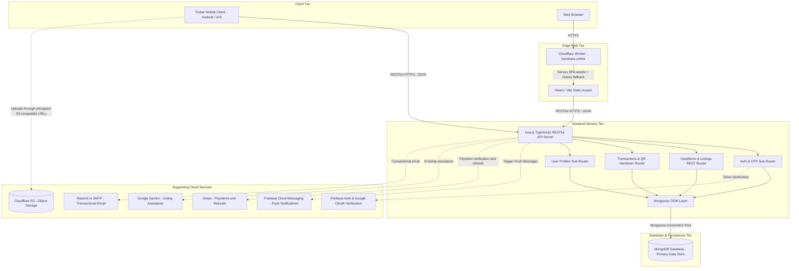

# System Architecture & Native Mobile Integrations

This document describes the high-level system architecture, database schema design, and native device integrations for the **KiwiShare** platform.

---

## 1. High-Level Architecture Overview

KiwiShare utilizes a decoupled client-server architecture hosted in a unified monorepo. Rather than relying purely on serverless Cloud Functions, KiwiShare runs a full, standalone **Node.js / Koa.js TypeScript RESTful Backend** backed by a dedicated **MongoDB** database:



### Component Roles & Responsibilities

* **Flutter Mobile App (`mobile/`)**: Cross-platform consumer application covering full-screen search and suggestions, recommendation-driven discovery, item-linked rich chat, Google Maps/location flows, Safe Pay, meetup coordination, wallet/payment methods, native deep-link handling, Trust Score and QR-based handover.
* **React Web App (`web/`) + Cloudflare Worker**: The Vite production bundle is deployed as Worker static assets behind `kiwishare.online` and `www.kiwishare.online`. The Worker serves SPA assets and history fallback routes, including public share handoff pages under `/s/:itemId`. Those pages attempt the native `kiwishare://` product deep link on mobile and otherwise offer store/install options plus a direct web-product fallback. Web API calls remain decoupled and target the Render-hosted Koa service.
* **Koa.js Dedicated RESTful Backend (`server/`)**: Full-featured Node.js / Koa.js application server hosted on Render. Exposes structured RESTful API resources (`/api/usedItems`, `/api/auth`, `/api/users`, `/api/transactions`) with centralized middleware for JWT authentication, request logging, CORS, and unified error handling.
* **MongoDB Database**: Core document database storing Users, Listings, Orders, Payments, OTP records, Messages, Reviews, Reports, Watchlists, Notification History, QR credentials and Audit Logs, with geospatial indexing for location queries.
* **Supporting Services**:
  - **Cloudflare R2**: S3-compatible object storage for listing and chat media, using backend-generated presigned upload URLs and configured public asset URLs.
  - **Google OAuth / Firebase Auth**: Identity verification tokens.
  - **Firebase Cloud Messaging / APNs**: Push delivery for chat, meetup, order and watchlist events.
  - **Firebase Remote Config**: Operational feature/configuration control for supported mobile behaviour.
  - **Stripe**: PaymentIntents, saved customer payment methods and refund verification for Safe Pay.
  - **Google Gemini**: Server-side AI assistance for seller-authored listing content.
  - **Resend / SMTP**: Transactional verification and marketplace-event email delivery.

---

## 2. Core MongoDB Collections & Data Schema

Data persistence is managed via **Mongoose** schemas defining high-integrity document structures:

### `users` Collection
```json
{
  "_id": "ObjectId('64e1f...01')",
  "email": "sam@kiwishare.co.nz",
  "displayName": "Sam Yao",
  "avatarUrl": "https://...",
  "trustScore": 100,
  "isVerified": true,
  "authProvider": "google",
  "passwordHash": "$2a$12$...",
  "createdAt": "2026-08-19T00:00:00.000Z",
  "updatedAt": "2026-08-19T00:00:00.000Z"
}
```

New users start with a Trust Score of 100. An eligible completed order awards +5 to each participant. Student verification currently adds +15, with the verification result capped at 200. Transaction rewards may take a stored score above 200; public surfaces display exact values through 200 and `200+` above 200, while administrator surfaces retain the exact stored value. Ratings and reviews do not change Trust Score.

### `items` / `usedItems` Collection
```json
{
  "_id": "ObjectId('64e1f...02')",
  "sellerId": "ObjectId('64e1f...01')",
  "title": "Retro Armchair",
  "description": "Comfortable vintage armchair in great shape.",
  "category": "Furniture",
  "condition": "good",
  "price": 4500,
  "currency": "NZD",
  "priceNzd": "45",
  "images": [
    { "url": "https://...", "thumbnailUrl": "https://...", "sortOrder": 0 }
  ],
  "location": {
    "city": "Auckland",
    "suburb": "Central",
    "coordinates": {
      "type": "Point",
      "coordinates": [174.7633, -36.8485]
    }
  },
  "isSustainable": true,
  "status": "active",
  "viewCount": 12,
  "favouriteCount": 3,
  "createdAt": "2026-08-19T00:00:00.000Z",
  "updatedAt": "2026-08-19T00:00:00.000Z"
}
```

### `orders` Collection
```json
{
  "_id": "ObjectId('64e1f...03')",
  "itemId": "ObjectId('64e1f...02')",
  "buyerId": "ObjectId('64e1f...04')",
  "sellerId": "ObjectId('64e1f...01')",
  "status": "completed",
  "completionCredit": {
    "pointsPerParticipant": 5,
    "awardedAt": "2026-08-19T00:00:00.000Z"
  },
  "createdAt": "2026-08-19T00:00:00.000Z"
}
```

The one-time QR credential is represented separately in the `qrCodes` collection. It is associated with an Order and its buyer and seller, has an expiry and lifecycle status, and is consumed as part of the authoritative handover transaction. The QR value is not an Order field.

---

## 3. Deep Integration of Native Mobile Capabilities

To deliver a premium mobile experience that stands apart from standard responsive web browsers, KiwiShare leverages Flutter's rich native device plugins:

| Native Capability | Plugin(s) | Integration & Value-Add Use-Case |
| :--- | :--- | :--- |
| **Camera & Image Capture** | `image_picker` | Direct high-resolution photo shooting & camera roll selection for pre-loved item listings, compressed prior to edge storage. |
| **Voice Note Recording & Playback** | `record`, `just_audio` | Hardware microphone capture for voice messaging in chat threads, coupled with streaming playback and visual audio timeline. |
| **QR Code Scanner & Generator** | `mobile_scanner`, `qr_flutter` | Real-time camera barcode scanner for buyer and high-contrast dynamic QR display for seller to complete in-person handovers. |
| **GPS Location & Geocoding** | `geolocator`, `geocoding` | Precision GPS location querying and reverse-geocoding to New Zealand suburbs (e.g., Ponsonby, Newmarket, Te Aro) for distance-based sorting. |
| **Native Google Maps** | `google_maps_flutter` | Embedded Google Maps surfaces connect marketplace discovery, item location and meetup context, with markers and hand-off to directions where appropriate. |
| **Push Notifications** | `firebase_messaging` | Native APNs/FCM background device notification channels alerting users to incoming buyer messages and meetup status updates. |
| **Cloud Remote Config** | `firebase_remote_config` | Dynamic over-the-air feature flag toggling and operational configuration without requiring app store resubmissions. |
| **Native Product Deep Links** | iOS URL schemes + Android browsable intent filters | `kiwishare:///items/:itemId` routes an installed app directly to the shared product while the public `/s/:itemId` page handles non-installed users. |

---

## 4. Order Completion and Trust Score Flow

To eliminate the common second-hand marketplace hazards of **buyer ghosting**, **unverified physical exchanges**, and **seller non-delivery**, KiwiShare implements a cryptographically hashed, atomic in-person handover protocol:

```mermaid
sequenceDiagram
    autonumber
    actor Seller as Seller (Mobile App)
    actor Buyer as Buyer (Mobile App)
    participant Server as Koa Backend API (/api)
    participant Mongo as MongoDB Atlas (Cluster)

    Note over Seller,Buyer: In-Person Meetup in Aotearoa (e.g. Ponsonby Central)
    Seller->>Seller: Opens Meetup Details & displays dynamic Handover QR Code
    Buyer->>Buyer: Taps "Scan Handover QR Code" (Opens camera via mobile_scanner)
    Buyer->>Seller: Scans Seller's QR Screen
    Buyer->>Server: POST /api/transactions/handover/claim { claimCode } (buyer JWT Auth)

    rect rgb(240, 248, 255)
        Note over Server,Mongo: Atomic Transaction Session (runMongoTransaction)
        Server->>Mongo: 1. Resolve active, unexpired QrCode and its Order
        Server->>Mongo: 2. Cross-check QR, Order, buyer, seller and Item identities; require the authenticated Order buyer
        Server->>Mongo: 3. Require an eligible confirmed meetup and reject self-transactions or unavailable Items
        Server->>Mongo: 4. Atomically complete Order, record completion credit, consume QR, transfer Item and increment each participant's trustScore by +5
        Mongo-->>Server: Commit Transaction
    end

    Server-->>Buyer: 200 OK { status: 'success', completion, item, newOwnerId }
    Buyer->>Buyer: UI displays celebration dialog & verified ownership
    Seller->>Server: Polls order status or receives FCM push
    Seller->>Seller: Order updates to "Completed" & Trust Score +5 confirmed
```

The QR claim endpoint is one supported order-completion path. It requires an active, unexpired QR code and the authenticated Order buyer, cross-checks the QR → Order → Item → participant relationships, and commits Order completion, QR consumption, Item transfer, completion metadata, and both +5 Trust Score increments in one required MongoDB transaction. An authorized retry of an already-completed order does not award credit again.

The application also exposes `POST /api/meetups/:orderId/confirm-handover`. The buyer and seller can each confirm through the meetup UI; after both confirmations, that handler completes the Order, consumes active QR records, transfers the Item, and increments both Trust Scores. Unlike the QR claim endpoint, this route does not require the buyer to scan a QR code, and its writes are currently sequential rather than part of one MongoDB transaction. Order reads such as `GET /api/orders/my` do not award credit. This distinction is important: both completion paths currently award credit, but their transaction and concurrency guarantees are not equivalent.

---

## 5. Marketplace Feedback Loops & Event-Driven Services

KiwiShare's product features share state rather than behaving as isolated modules:

- **Recommendation loop:** watchlist categories and keywords, user proximity, favourites, views, freshness, sustainability and condition contribute to a transparent weighted recommendation score.
- **Notification loop:** price-drop events use deduplicated notification history, daily caps, push and email delivery; price increases and nearby/category-relevant listings use preference-aware push alerts.
- **Trust loop:** eligible completed exchanges update Trust Score and unlock transaction-bound review opportunities.
- **Monetisation loop:** KiwiGold and VIP promotion state influence featured/discovery placement while promoted inventory remains explicitly identifiable.
- **Transaction loop:** payment, meetup and handover state are owned by the backend; both Flutter and React render the same derived readiness flags and next actions.
- **Sharing loop:** public `/s/:itemId` links preserve a path from external sharing back to the exact product, either through the native app deep link or the React product page.

This coupling is deliberate: an action in one stage of the marketplace creates verified signals for the next stage instead of leaving discovery, chat, payment and reputation as separate silos.

## 6. Payment, Membership & Marketplace Operations

- **Safe Pay:** Stripe PaymentIntents are created and verified server-side; the client does not get to declare a paid order by itself. Payment records are idempotent and carry refund/dispute status.
- **Wallet / saved cards:** Stripe customer/payment-method state is exposed through the profile wallet UI for checkout and saved-card management.
- **Seller release:** completion state records when funds become eligible for seller release after handover conditions are satisfied. Product copy should describe this as an **escrow-style application workflow**, not claim that KiwiShare is a regulated escrow institution or that a real segregated escrow account is implemented.
- **KiwiGold:** platform credits can be spent to promote an eligible listing.
- **VIP membership:** monthly membership state includes expiry and auto-renew controls and can grant unlimited listing promotions.
- **Admin operations:** the React administration surface provides marketplace analytics plus user, listing and category controls so the system has an operational/governance plane in addition to consumer clients.

## 7. Search, Recommendations & Sharing

- **Search-as-you-type:** the current production path is server-backed deterministic autocomplete over active marketplace data. It is fast and explainable; the repository also carries a Remote Config flag for a future AI/semantic-search experiment, but the current suggestion endpoint should not be presented as model-generated AI.
- **Recommendations:** the recommendation endpoint is a weighted ranking engine, not a black-box ML model. It combines watchlist/category affinity, keyword affinity, geographic proximity, engagement, freshness, sustainability and condition.
- **Share handoff:** the canonical external share surface is the short public `/s/:itemId` route. On supported mobile browsers it attempts `kiwishare:///items/:itemId`; if the app is unavailable, the page offers install destinations and **Continue on web**.
