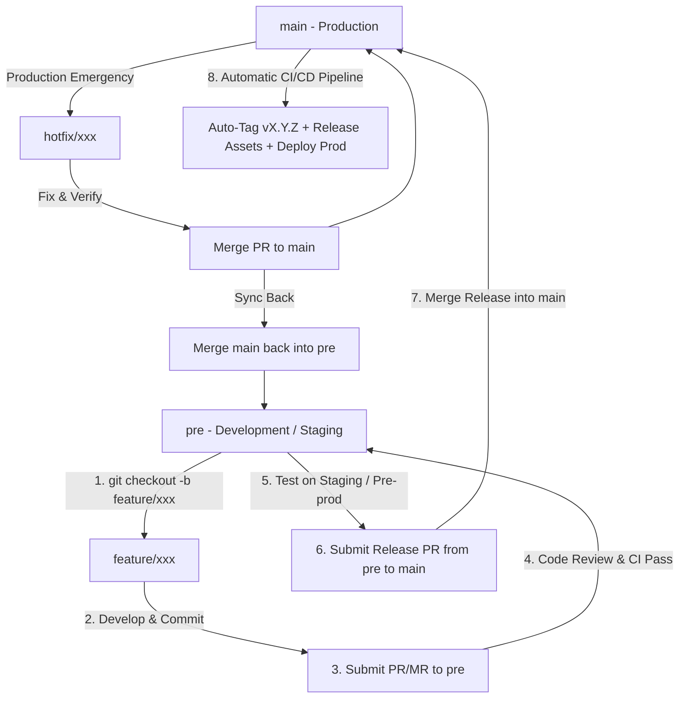

# Git Flow Code Collaboration & Release Strategy

This document outlines the **Git Flow** branching model, development lifecycle, hotfix workflow, and release synchronization procedures for the **KiwiShare** project.

---

## 1. Branching Model Overview

KiwiShare adopts the **Git Flow** branching strategy with our continuous integration and testing environment centered on the `pre` branch (analogous to `develop`):

1. **`main` (Production)**: Contains stable, production-ready release code. Every commit on `main` represents an official release version. Merging into `main` automatically triggers production release workflows, semantic versioning tags (`vX.Y.Z`), mobile artifact compilation (APK/iOS package), and cloud production deployment.
2. **`pre` (Development & Pre-production / Staging)**: The integration branch (serving as `develop`). All active feature developments and bug fixes merge into `pre`. It continuously reflects the latest staging test environment (Firebase App Distribution & Staging API).
3. **`feature/*` (Feature Branches)**: Dedicated branches for new features, chores, or standard enhancements. **All feature branches MUST be branched from `pre`** and merged back into `pre` upon completion.
4. **`hotfix/*` (Critical Production Fixes)**: Branches created directly from `main` to address critical emergency bugs in production. Merged into `main` for immediate release and **merged back into `pre`** to prevent environment drift.

### Workflow Visualization:



---

## 2. Standard Development Workflow

To maintain repository consistency, team members follow this streamlined flow:

### Step 1: Branch from `pre`
Always ensure your local `pre` branch is up-to-date before starting new work:
```bash
git checkout pre
git pull origin pre
git checkout -b feature/your-feature-name
```

### Step 2: Commit Changes
Commit your work following [Conventional Commits](https://www.conventionalcommits.org/):
```bash
git add .
git commit -m "feat(usedItems): implement restful usedItems query endpoints"
```

### Step 3: Submit Pull Request targeting `pre`
Push your branch to GitHub:
```bash
git push origin feature/your-feature-name
```
Open a Pull Request (PR) with base set to **`pre`**.
- Automated lint, formatting, and unit tests will run against your PR.
- Request code reviews from peers.

### Step 4: Staging Testing & Verification
Once merged into `pre`:
- The backend staging service automatically updates.
- QA and developers verify functionality in the staging environment.

### Step 5: Release Promotion (`pre` ➔ `main`)
When a milestone or sprint release is verified and ready for production:
1. Submit a Pull Request from **`pre`** to **`main`**.
2. Upon approval and merge:
   - **GitHub Actions automatically runs the Release Pipeline**:
     - Calculates the new semantic version and tags the repository (`vX.Y.Z`).
     - Compiles the Android APK (`KiwiShare-Android-vX.Y.X.apk`) and iOS archive.
     - Publishes the GitHub Release with downloadable packages and changelog.
     - Uploads the Android build to Firebase App Distribution.
   - **Cloud hosting automatically deploys the updated backend service**.

---

## 3. Production Hotfix Workflow

When an urgent issue is found in production:

1. **Create the Hotfix branch from `main`**:
   ```bash
   git checkout main
   git pull origin main
   git checkout -b hotfix/critical-bug-name
   ```
2. **Implement & Test Fix Locally**:
   ```bash
   git commit -m "fix(auth): resolve token refresh edge-case"
   ```
3. **Merge to `main` for Emergency Release**:
   - Open PR targeting `main`.
   - Once merged, the release pipeline tags and deploys the hotfix immediately.

---

## 4. Syncing Hotfixes Back to `pre` (Merge-Back)

> [!IMPORTANT]
> Whenever a hotfix is merged directly into `main`, you **MUST** immediately synchronize `pre` to avoid branch drift and future merge conflicts.

```bash
# 1. Pull latest main
git checkout main
git pull origin main

# 2. Switch to pre and merge main
git checkout pre
git pull origin pre
git merge main -m "chore: sync production hotfixes from main into pre"

# 3. Push updated pre
git push origin pre
```
