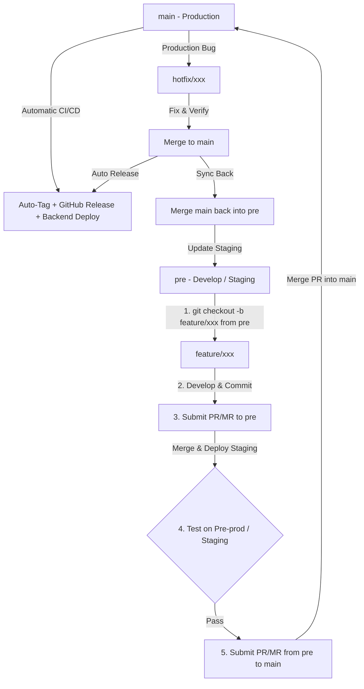

# Git Flow Code Collaboration & Release Strategy

> **Note**: KiwiShare has transitioned from GitLab Flow to **Git Flow**. For the latest details, see [Git Flow Guide](file:///Users/samyao/Work/project-implementation-five-guys/docs/git-flow.md).

This document outlines the **Git Flow** branching model, development lifecycle, hotfix workflow, and release synchronization procedures for the **KiwiShare** project.

---

## 1. Branching Model Overview

KiwiShare adopts the **Git Flow** branching strategy with our continuous integration and testing environment centered on the `pre` branch (analogous to `develop`):

1. **`main` (Production)**: Stores the stable, production-ready code. Merging into `main` automatically triggers production release, tagging, and package building.
2. **`pre` (Development & Staging / Pre-production)**: Acts as the `develop` integration branch. All new feature branches are created from `pre` and merged back into `pre`.
3. **`feature/*` (Development)**: Short-lived branches created from `pre` used by developers to implement features, chores, or bug fixes.
4. **`hotfix/*` (Critical Hotfixes)**: Short-lived branches created directly from `main` to address urgent production bugs, merged into `main` and then back into `pre`.

### Workflow Visualization:



---

## 2. Development Guidelines

To maintain code quality and prevent environment drift, all developers must follow this sequence:

### Step 1: Create a Feature Branch from `pre`
Always base new features on the latest development code (`pre`):
```bash
git checkout pre
git pull origin pre
git checkout -b feature/your-feature-name
```

### Step 2: Merge into `pre` for Verification
When the feature is ready, commit your changes using Conventional Commits and push the branch:
```bash
git push origin feature/your-feature-name
```
Create a Pull/Merge Request (PR/MR) targeting the **`pre`** branch. 
*Do not merge directly into `main`.*

### Step 3: Testing and Validation
- Code analysis, formatting, and unit tests will run automatically on the PR to `pre`.
- Once merged to `pre`, the staging environment is updated (Firebase App Distribution for testers, staging backend API).
- Product owners, QA, or team members test the feature on `pre`.

### Step 4: Promote to Production (`main`)
After testing is complete and the feature is confirmed stable:
1. Submit a PR/MR from **`pre`** to **`main`**.
2. Once the PR is approved and merged into `main`:
   - **GitHub Actions automatically runs the Release Pipeline**:
     - Calculates the new semantic version and creates the release tag (`vX.X.X`).
     - Builds the Android APK (`KiwiShare-Android-vX.X.X.apk`) and iOS Package.
     - Publishes the GitHub Release with downloadable packages and release notes.
     - Uploads the Android build to Firebase App Distribution.
   - **Cloud host automatically detects the push to `main` and redeploys the backend API**.

---

## 3. Hotfix Guidelines

If a critical bug is discovered in production (`main`), follow this path to resolve it quickly:

1. **Create the Hotfix branch** directly from `main`:
   ```bash
   git checkout main
   git pull origin main
   git checkout -b hotfix/bug-description
   ```
2. **Implement and test the fix** locally.
3. **Submit a PR/MR to `main`**:
   - Merge the PR to `main` after review.
   - GitHub Actions will automatically tag the hotfix release (e.g., `v1.0.1`) and deploy it immediately.

---

## 4. Merge Back to `pre`

> [!IMPORTANT]  
> Whenever a hotfix is merged directly into `main`, the `pre` branch must be synchronized to prevent branch drift.

```bash
git checkout main
git pull origin main
git checkout pre
git pull origin pre
git merge main -m "chore: merge back production hotfixes from main"
git push origin pre
```
