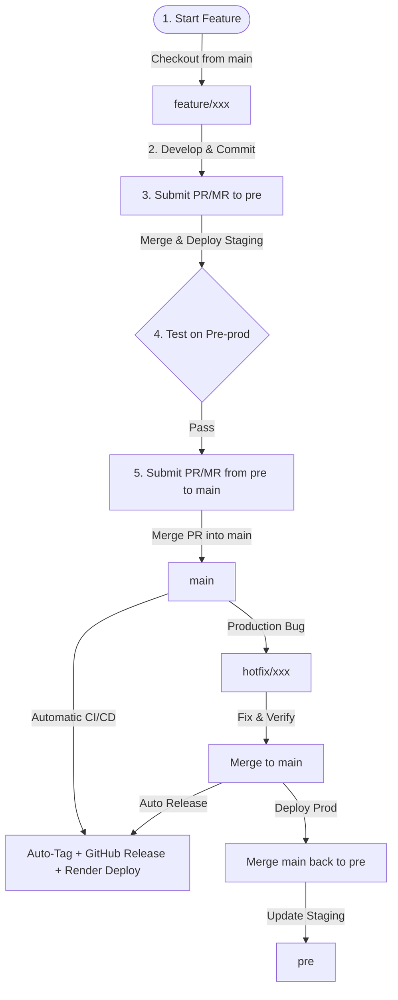

# GitLab Flow Code Collaboration Guide

This document outlines the branching strategy, development rules, hotfix workflow, and environment alignment procedures for the **KiwiShare** project.

---

## 1. Branching Model Overview

We use a simplified environment-based **GitLab Flow** consisting of three types of branches:

1. **`main` (Production)**: Stores the stable, production-ready code. Merging into `main` automatically triggers production release, tagging, and package building.
2. **`pre` (Pre-production / Testing)**: Reflects the staging/testing environment. All new features must be merged and verified here before reaching production.
3. **`feature/*` (Development)**: Short-lived branches used by developers to implement features, chores, or standard bug fixes.

### Workflow Visualization:



---

## 2. Development Guidelines

To maintain code quality and prevent environment drift, all developers must follow this sequence:

### Step 1: Create a Feature Branch
Always base new features on the latest production code (`main`) to avoid carrying unfinished code from `pre`:
```bash
git checkout main
git pull origin main
git checkout -b feature/your-feature-name
```

### Step 2: Merge into `pre` for Verification
When the feature is ready, commit your changes using Conventional Commits and push the branch:
```bash
git push origin feature/your-feature-name
```
Create a Pull/Merge Request (PR/MR) targeting the **`pre`** branch. 
*Do not merge directly into `main`.*

### Step 3: Testing and Validation
- Code analysis, formatting, and unit tests will run automatically on the PR to `pre`.
- Once merged to `pre`, the staging environment is updated (Firebase App Distribution for testers, Render staging for backend API).
- Product owners, QA, or team members test the feature on `pre`.

### Step 4: Promote to Production (`main`)
After testing is complete and the feature is confirmed stable:
1. Submit a PR/MR from **`pre`** to **`main`**.
2. Once the PR is approved and merged into `main`:
   - **GitHub Actions automatically runs the Release Pipeline**:
     - Calculates the new semantic version and creates the release tag (`vX.X.X`).
     - Builds the Android APK (`KiwiShare-Android-vX.X.X.apk`) and iOS Package (`KiwiShare-iOS-vX.X.X.zip`).
     - Publishes the GitHub Release with downloadable packages and release notes.
     - Uploads the Android build to Firebase App Distribution.
   - **Render automatically detects the push to `main` and redeploys the backend API**.

---

## 3. Hotfix Guidelines

If a critical bug is discovered in production (`main`), follow this path to resolve it quickly:

1. **Create the Hotfix branch** directly from `main`:
   ```bash
   git checkout main
   git pull origin main
   git checkout -b hotfix/bug-description
   ```
2. **Implement and test the fix** locally.
3. **Submit a PR/MR to `main`**:
   - Merge the PR to `main` after review.
   - GitHub Actions will automatically tag the hotfix release (e.g., `v1.0.1`) and deploy it immediately.

---

## 4. Merge Back to `pre`

> [!IMPORTANT]  
> Whenever a hotfix is merged directly into `main`, the `pre` branch becomes outdated and suffers from **branch drift**. 

To prevent future merge conflicts, you must **merge back** the changes from `main` into `pre` immediately after the hotfix is deployed.

### Step-by-Step Merge Back:

1. Fetch and pull the latest changes from `main`:
   ```bash
   git checkout main
   git pull origin main
   ```
2. Switch to the `pre` branch:
   ```bash
   git checkout pre
   git pull origin pre
   ```
3. Merge `main` into `pre`:
   ```bash
   git merge main -m "chore: merge back production hotfixes from main"
   ```
4. Resolve conflicts if any exist, then push to GitHub:
   ```bash
   git push origin pre
   ```
*This ensures that both environments are synchronized and subsequent features created from `main` will merge cleanly into `pre`.*
